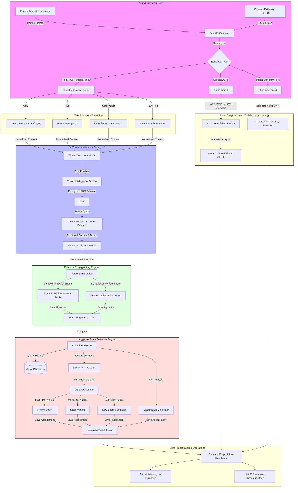

# SentinelAI — Adaptive Fraud Intelligence & Digital Public Safety Platform
**🌐:** https://sentinelai-rm0s.onrender.com
> **Economic Times AI Hackathon 2026 — Project Blueprint & Execution Flow**
> An AI-powered Digital Public Safety Platform designed to proactively detect, analyze, predict, and prevent digital fraud before citizens become victims.

--- -

## 🌟 Vision & Platform Overview

SentinelAI is an adaptive platform engineered to protect citizens and support law enforcement by analyzing multi-modal cyber threat vectors (Text messages, URL phishing sites, PDF bank notices/advisories, screenshots, speech audio recordings, and counterfeit currency images). 

Unlike legacy keyword-based detection systems, SentinelAI converts raw evidence into structured **Scam Behavior Fingerprints** (representing authority impersonation, psychological tactics, victim demographics, technology signatures, and execution steps). It then runs these profiles through an **Adaptive Scam Evolution Engine** to automatically classify scams as **Known Scams**, **Evolving Variants**, or **New Scam Campaigns** while building a dynamic, interactive **Fraud Knowledge Graph** to reveal interconnected networks.

---

## 🏗️ High-Level System Architecture

The following diagram illustrates how evidence moves from the user interfaces, through the ingestion pipelines, AI models, fingerprint generators, and evolution classifiers, before being persisted to MongoDB and displayed to the user:



---

## 📂 Project Directory Structure

### 1. Backend Service (`backend/`)
The backend is built with **FastAPI**, **Pydantic v2**, and uses **Beanie ODM** as the object-document mapper for a **MongoDB** database.

*   [main.py](file:///c:/Users/Admin/Downloads/ET/ET/backend/main.py) — The application entry point. Initializes settings, logger, and runs the FastAPI server.
*   `app/` — Main application codebase:
    *   [factory.py](file:///c:/Users/Admin/Downloads/ET/ET/backend/app/factory.py) — Application factory class configuring CORS middleware, global exception handlers, custom lifespans (handling database initialization/teardown), and route registration.
    *   `api/` — API Routes (Controllers):
        *   `v1/` — Route versioning container:
            *   [router.py](file:///c:/Users/Admin/Downloads/ET/ET/backend/app/api/v1/router.py) — Aggregates and prefixes all underlying routing routers.
            *   `endpoints/` — Endpoint modules:
                *   [analyze.py](file:///c:/Users/Admin/Downloads/ET/ET/backend/app/api/v1/endpoints/analyze.py) — The primary pipeline orchestrator routing ingestion, intelligence extraction, fingerprinting, evolution calculation, live stats, knowledge graph serialization, and market advisory synchronizations.
                *   [audio.py](file:///c:/Users/Admin/Downloads/ET/ET/backend/app/api/v1/endpoints/audio.py) — Speech recording deepfake authenticity checks.
                *   [currency.py](file:///c:/Users/Admin/Downloads/ET/ET/backend/app/api/v1/endpoints/currency.py) — Indian currency note verification scan endpoints.
                *   [documents.py](file:///c:/Users/Admin/Downloads/ET/ET/backend/app/api/v1/endpoints/documents.py) — Standard CRUD operations and file/URL ingestion entries for raw threat documents.
                *   [health.py](file:///c:/Users/Admin/Downloads/ET/ET/backend/app/api/v1/endpoints/health.py) — Health checking endpoint detailing dependency state.
    *   `core/` — Infrastructure configurations:
        *   `config.py` — Central singleton managing environment variables via `Pydantic Settings`.
        *   `exceptions.py` / `handlers.py` / `ingestion_exceptions.py` — Custom system exception rules and custom FastAPI exception handler middlewares.
        *   `logging.py` — High-performance logging framework leveraging `Loguru`.
    *   `database/` — Data Access layer:
        *   [session.py](file:///c:/Users/Admin/Downloads/ET/ET/backend/app/database/session.py) — Manages connections via Beanie and `AsyncIOMotorClient`.
        *   `models/` — MongoDB database schemas (Documents):
            *   [threat.py](file:///c:/Users/Admin/Downloads/ET/ET/backend/app/database/models/threat.py) — Schema for raw `ThreatDocumentModel` & metadata tracking.
            *   [intelligence.py](file:///c:/Users/Admin/Downloads/ET/ET/backend/app/database/models/intelligence.py) — Schema for AI extracted structured fields (`ThreatIntelligenceModel`).
            *   [fingerprint.py](file:///c:/Users/Admin/Downloads/ET/ET/backend/app/database/models/fingerprint.py) — Schema for behavior profiles (`ScamFingerprintModel`).
            *   [evolution.py](file:///c:/Users/Admin/Downloads/ET/ET/backend/app/database/models/evolution.py) — Schema storing comparison outcomes (`EvolutionResultModel`).
    *   `repositories/` — Decoupled data access logic:
        *   `threat_document_repository.py` / `fingerprint_repository.py` / `evolution_repository.py` / `processing_log_repository.py` — Handle MongoDB database transactions.
    *   `services/` — Business logic micro-services:
        *   `extraction/` — Content parsing:
            *   [ocr_service.py](file:///c:/Users/Admin/Downloads/ET/ET/backend/app/services/extraction/ocr_service.py) — Extracts text from screenshots using `pytesseract`.
            *   [pdf_parser.py](file:///c:/Users/Admin/Downloads/ET/ET/backend/app/services/extraction/pdf_parser.py) — Parses text from PDFs using `pypdf`.
            *   [article_extractor.py](file:///c:/Users/Admin/Downloads/ET/ET/backend/app/services/extraction/article_extractor.py) — Crawls URL pages and extracts article metadata using `BeautifulSoup4` + `httpx`.
            *   [text_extractor.py](file:///c:/Users/Admin/Downloads/ET/ET/backend/app/services/extraction/text_extractor.py) — Router dynamically selecting extraction algorithms based on input type.
        *   `intelligence/` — Structured AI analysis:
            *   [threat_intelligence_service.py](file:///c:/Users/Admin/Downloads/ET/ET/backend/app/services/intelligence/threat_intelligence_service.py) — Orchestrator driving prompt creation, LLM invocation, schema verification, and parsing.
            *   [gemini_service.py](file:///c:/Users/Admin/Downloads/ET/ET/backend/app/services/intelligence/gemini_service.py) — Interfaces directly with Google Gemini.
            *   [prompt_manager.py](file:///c:/Users/Admin/Downloads/ET/ET/backend/app/services/intelligence/prompt_manager.py) — Builds the system and user prompts detailing structure and format instruction.
            *   [json_repair_service.py](file:///c:/Users/Admin/Downloads/ET/ET/backend/app/services/intelligence/json_repair_service.py) — Post-processes raw LLM responses to ensure valid JSON syntax.
        *   `fingerprint/` — Forensic analysis:
            *   [fingerprint_service.py](file:///c:/Users/Admin/Downloads/ET/ET/backend/app/services/fingerprint/fingerprint_service.py) — Forensics orchestrator.
            *   [behavior_analyzer.py](file:///c:/Users/Admin/Downloads/ET/ET/backend/app/services/fingerprint/behavior_analyzer.py) — Maps free-form text features into structured enum profiles.
            *   [behavior_vector_generator.py](file:///c:/Users/Admin/Downloads/ET/ET/backend/app/services/fingerprint/behavior_vector_generator.py) — Computes weighted numeric threat representations.
        *   `evolution/` — Mutation detection:
            *   [evolution_service.py](file:///c:/Users/Admin/Downloads/ET/ET/backend/app/services/evolution/evolution_service.py) — Matches new signatures against historical catalog.
            *   [similarity_calculator.py](file:///c:/Users/Admin/Downloads/ET/ET/backend/app/services/evolution/similarity_calculator.py) — Evaluates profile matches using a weighted Jaccard calculation.
            *   [variant_classifier.py](file:///c:/Users/Admin/Downloads/ET/ET/backend/app/services/evolution/variant_classifier.py) — Determines evolution status using similarity thresholds.
            *   [novelty_calculator.py](file:///c:/Users/Admin/Downloads/ET/ET/backend/app/services/evolution/novelty_calculator.py) — Calculates novelty as inverse of maximum similarity.
            *   [explanation_generator.py](file:///c:/Users/Admin/Downloads/ET/ET/backend/app/services/evolution/explanation_generator.py) — Writes human-readable diff logs explaining mutations.
        *   `model/` — Local ML inference engines:
            *   [audio_deepfake_detector.py](file:///c:/Users/Admin/Downloads/ET/ET/backend/app/services/model/audio_deepfake_detector.py) — Integrates Wav2Vec2 audio classification models.
            *   [currency_note_detector.py](file:///c:/Users/Admin/Downloads/ET/ET/backend/app/services/model/currency_note_detector.py) — Loads and executes Keras CNN models to find counterfeit signs on Indian Rupee notes.

### 2. Frontend Application (`frontend-react/`)
A responsive **React SPA** built with **Vite**, **Vanilla CSS**, and **Lucide Icons** for icons.

*   [App.jsx](file:///c:/Users/Admin/Downloads/ET/ET/frontend-react/src/App.jsx) — Controls top-level navigation layout routing.
*   `src/components/` — UI dashboard components:
    *   [Dashboard.jsx](file:///c:/Users/Admin/Downloads/ET/ET/frontend-react/src/components/Dashboard.jsx) — Aggregated views showing case counters, critical threat alerts, recent scam feeds, threat classification charts (built with `Recharts`), and ML engine status.
    *   [ThreatAnalyzer.jsx](file:///c:/Users/Admin/Downloads/ET/ET/frontend-react/src/components/ThreatAnalyzer.jsx) — Citizen-first analysis page. Handles multi-modal entries (Text, Link, Files). Returns user-friendly safe/scam banners alongside technical dropdown profiles (confidence, psy-tactics, prevention tips, entity logs).
    *   [CurrencyShield.jsx](file:///c:/Users/Admin/Downloads/ET/ET/frontend-react/src/components/CurrencyShield.jsx) — Interface capturing images via device webcam or file uploads, sending images for counterfeit detection.
    *   [AudioShield.jsx](file:///c:/Users/Admin/Downloads/ET/ET/frontend-react/src/components/AudioShield.jsx) — Captures voice audio recording via microphone or audio files, requesting deepfake voice scans.
    *   [KnowledgeGraph.jsx](file:///c:/Users/Admin/Downloads/ET/ET/frontend-react/src/components/KnowledgeGraph.jsx) — Visualizes relationships between scams, authorities, phone numbers, and UPI IDs using `react-force-graph-2d`.
    *   [ScamIntelligence.jsx](file:///c:/Users/Admin/Downloads/ET/ET/frontend-react/src/components/ScamIntelligence.jsx) — Aggregates trending categories and details chronological lists of scam variants.
    *   [LawEnforcement.jsx](file:///c:/Users/Admin/Downloads/ET/ET/frontend-react/src/components/LawEnforcement.jsx) — Geospatial hotspot table and bar charts tracking authority impersonations.
    *   [SystemStatus.jsx](file:///c:/Users/Admin/Downloads/ET/ET/frontend-react/src/components/SystemStatus.jsx) — Grid monitoring the API latency, database connection state, and local neural network availability.
*   `src/services/` — Network communications:
    *   [api.js](file:///c:/Users/Admin/Downloads/ET/ET/frontend-react/src/services/api.js) — Houses HTTP requests routing Axios commands to endpoints.

### 3. SentinelAI Threat Shield Browser Extension (`extension/`)
A Manifest V3 Chrome / Edge / Brave browser extension providing real-time citizen protection directly in the browser:

*   `manifest.json` — Manifest V3 configuration with active tab, scripting, storage, and host permissions for `http://localhost:8000`.
*   `popup.html` / `popup.css` / `popup.js` — Dark glassmorphic extension UI with tab switcher for **URL Shield**, **PDF Scanner**, and **Live Stats**.
*   `background.js` — Service worker listening to active tab URL navigation and updating the browser action badge text/color (`SAFE`, `WARN`, `RISK`).
*   `content.js` / `content.css` — Content script injecting **"🛡️ AI Verify"** badges next to on-page PDF links and rendering floating threat report modals.
*   `generate_icons.py` / `icons/` — PNG icon generators (16x16, 48x48, 128x128).

---

## 🔄 End-to-End Core Pipelines & Working Flow

### 1. Ingestion Pipeline
When text, URL, PDF, or screenshots are uploaded:
1.  **Validation**: `DocumentValidator` verifies file size, mime-types, and constraints.
2.  **Input Normalization**: Standardizes raw models into an `IngestionInput` structure.
3.  **Extraction Routing**:
    *   *Web URLs* are scraped using HTTPX, retrieving clean article body text and metadata (forms, external script links, descriptions) via `BeautifulSoup`.
    *   *PDF files* are parsed locally using `pypdf`.
    *   *Image screenshots* run through `pytesseract` OCR to extract text content.
4.  **Metadata Extraction**: Extracts country, language, and core descriptors.
5.  **Persistence**: Saves record as a `ThreatDocumentModel` in the `threat_documents` MongoDB collection.

### 2. Threat Intelligence Pipeline (LLM)
Once the document is stored, it runs through the Intelligence Core:
1.  **Prompt Engineering**: Generates a system prompt defining strict schema expectations and injects the document text alongside extraction metadata into the user prompt.
2.  **Gemini Call**: Hits the Gemini API using `GeminiService` to parse details into structured JSON.
3.  **JSON Repair & Validation**: If the LLM response contains trailing commas or invalid JSON formatting, `JSONRepairService` cleans it. `ResponseValidator` verifies schema compliance.
4.  **Persistence**: Saves the output as a `ThreatIntelligenceModel` in the `threat_intelligence` MongoDB collection.

### 3. Scam Behavioral Fingerprinting Engine
Standardizes intelligence findings into behavioral traits:
1.  **Enum Mapping**: `BehaviorAnalyzer` performs substring token matching to assign findings to structured category enums:
    *   `AuthorityProfile`: *Police, Bank, Tax, Telecom, Courier, KYC, etc.*
    *   `PsychologyProfile`: *Authority Fear, Isolation, Urgency, Greed, etc.*
    *   `TechnologyProfile`: *WhatsApp, Telegram, VPN, Remote Desktop, Screen Share, Fake Website, etc.*
    *   `FinancialProfile`: *UPI, Crypto, RTGS/IMPS, Cash, Mule Account, etc.*
    *   `VictimProfile`: *Elderly, Student, Job Seeker, Retail Investor, etc.*
    *   `ExecutionProfile`: *Cold Call, Phishing Link, Threat Video Call, Fake Arrest, etc.*
2.  **Numerical Vector Generation**: Maps categorical enums into a float vector array, generating a mathematical representation of the scam.
3.  **Persistence**: Stores as a `ScamFingerprintModel` in the `scam_fingerprints` MongoDB collection.

### 4. Adaptive Scam Evolution Engine
Determines how scams are mutating over time:
1.  **Historical Matching**: Fetches all previous fingerprints.
2.  **Similarity Analysis**: Compares the new fingerprint against all history using `SimilarityCalculator` which performs weighted Jaccard similarity checks over the profiles:
    
    $$\text{Jaccard Similarity} = \frac{|A \cap B|}{|A \cup B|}$$

    It weights each category match according to values defined in `ConfigurationManager`:
    *   *Psychology Profile*: 20%
    *   *Authority, Financial, Technology, Execution*: 15% each
    *   *Communication, Victim*: 10% each
3.  **Variant Classification**:
    *   Similarity Score $\ge$ **90%**: Classified as **`KNOWN_SCAM`** (tactics match an active campaign).
    *   Similarity Score $\ge$ **60%**: Classified as **`SCAM_VARIANT`** (shares DNA but shifts specific parameters).
    *   Similarity Score **< 60%**: Classified as **`NEW_SCAM`** (entirely novel campaign).
4.  **Novelty Calculation**: Calculates novelty score as $100.0 - \text{max similarity}$.
5.  **Diff Explanation Generation**: `ExplanationGenerator` compares the new fingerprint with the closest historical match and dynamically lists what tactics/channels were **added** or **removed**.
6.  **Persistence**: Saves report as an `EvolutionResultModel` in the `evolution_results` MongoDB collection.

### 5. Resilient Fallback Mode
If the Gemini API key is missing or quotas are exhausted:
*   The system intercepts the failure and invokes `_build_smart_fallback_response`.
*   It runs quick, deterministic python regex engines matching classic scam keywords (e.g., "arrest", "cbi", "police", "refund", "upi", "win") to calculate a risk score.
*   Returns safety warnings and citizen instructions immediately to guarantee uninterrupted application availability.

---

## 🔬 Machine Learning Shields (Hugging Face ZeroGPU Integration)

To support instant, high-throughput GPU model inference without bloating local backend deployments on Render (~660 MB of model weights saved), SentinelAI delegates deep learning model inference directly to the **Hugging Face Space GPU Instance** [`Divyaksh1209/cybersec-prototype`](https://huggingface.co/spaces/Divyaksh1209/cybersec-prototype).

### 1. End-to-End Flow
```
[Frontend Client (React)] 
       │
       ▼ (HTTP Multipart / JSON)
[FastAPI Backend Gateway] 
       │
       ▼ (gradio_client API)
[Hugging Face Space: Divyaksh1209/cybersec-prototype (ZeroGPU)]
   ├── /load_and_predict_currency (Counterfeit Indian Currency CNN)
   ├── /load_and_predict_voice (Wav2Vec2 Voice Deepfake Detector)
   └── /load_and_predict_ai_image (AI-Generated Image Detector)
```

### 2. Hugging Face Space `app.py` Reference Code
The Hugging Face Space `app.py` exposes explicit `api_name` parameters for seamless backend client calls:

```python
import gradio as gr

def load_and_predict_ai_image(input_image):
    return "AI Image Detection Result"

def load_and_predict_currency(input_currency):
    return "Counterfeit Currency Result"

def load_and_predict_voice(input_audio):
    return "Voice Deepfake Result"

with gr.Blocks(title="SentinelAI Model Gateway") as demo:
    gr.Markdown("# 🛡️ SentinelAI Cyber Security AI Space")
    
    with gr.Tab("AI Image Detector"):
        img_input = gr.Image(type="filepath", label="Upload Image")
        img_output = gr.Textbox(label="Detection Result")
        img_btn = gr.Button("Analyze Image")
        img_btn.click(
            fn=load_and_predict_ai_image,
            inputs=img_input,
            outputs=img_output,
            api_name="load_and_predict_ai_image"
        )
        
    with gr.Tab("Currency Note Shield"):
        currency_input = gr.Image(type="filepath", label="Upload Currency Note")
        currency_output = gr.Textbox(label="Currency Result")
        currency_btn = gr.Button("Analyze Currency Note")
        currency_btn.click(
            fn=load_and_predict_currency,
            inputs=currency_input,
            outputs=currency_output,
            api_name="load_and_predict_currency"
        )
        
    with gr.Tab("Voice Deepfake Shield"):
        audio_input = gr.Audio(type="filepath", label="Upload Voice Audio")
        audio_output = gr.Textbox(label="Audio Result")
        audio_btn = gr.Button("Analyze Voice Authenticity")
        audio_btn.click(
            fn=load_and_predict_voice,
            inputs=audio_input,
            outputs=audio_output,
            api_name="load_and_predict_voice"
        )

demo.launch()
```

### 3. FastAPI Backend Integration (`gradio_client`)
```python
from gradio_client import Client, handle_file
from app.core.config import get_settings

settings = get_settings()
client = Client(settings.hf_space_name, hf_token=settings.hf_token or None)

# Currency Counterfeit Check
prediction = client.predict(
    input_currency=handle_file(tmp_image_path),
    api_name="/load_and_predict_currency"
)

# Audio Deepfake Check
prediction = client.predict(
    input_audio=handle_file(tmp_audio_path),
    api_name="/load_and_predict_voice"
)
```

### 4. Machine Learning Shields Summary
*   **Audio Shield**: Evaluates Wav2Vec2 voice clone probabilities and acoustic threat signals (peak clipping, RMS level, silence ratios).
*   **Currency Shield**: Evaluates Indian Rupee note images from file uploads or live camera streams against counterfeit vs genuine CNN classification.
*   **AI Image Detector Shield**: Checks image authenticity (real photography vs synthetic AI generation).

---

## 🚀 Installation & Local Execution Guide

### Prerequisites
*   **Python 3.10+** (Python 3.11/3.12 recommended)
*   **Node.js 18+** & npm
*   **MongoDB** (Local instance or Atlas connection string)
*   **Tesseract OCR Engine** (Required for screenshot parsing. Install via apt, brew, or download the Windows installer and ensure `tesseract` is added to system PATH variables)

---

### Step 1: Run MongoDB
Ensure your local MongoDB instance is running, or get your MongoDB Atlas connection string ready.

---

### Step 2: Configure and Start FastAPI Backend
1.  Navigate into the `backend/` folder:
    ```bash
    cd backend
    ```
2.  Create and activate a virtual environment:
    ```bash
    python -m venv venv
    
    # On Windows (PowerShell):
    .\venv\Scripts\Activate.ps1
    # On macOS/Linux:
    source venv/bin/activate
    ```
3.  Install all backend dependencies:
    ```bash
    pip install -r requirements.txt
    ```
4.  Configure environment variables by copying `.env.example` to `.env`:
    ```bash
    cp .env.example .env
    ```
    Open `.env` and configure:
    ```env
    MONGO_URI=mongodb://localhost:27017
    MONGO_DB=sentinel_ai
    GEMINI_API_KEY=your_google_gemini_api_key_here
    ```
5.  Start the FastAPI application:
    ```bash
    python main.py
    ```
    The server will spin up on `http://localhost:8000`. You can access documentation at `http://localhost:8000/docs`.

---

### Step 3: Run the Frontend (React + Vite)
1.  Open a new terminal session and navigate into the `frontend-react/` folder:
    ```bash
    cd frontend-react
    ```
2.  Install packages:
    ```bash
    npm install
    ```
3.  Run the Vite development server:
    ```bash
    npm run dev
    ```
    The frontend client will boot up. Open your browser and navigate to the address (typically `http://localhost:5173`).

---

### Step 4: Load Chrome / Edge Browser Extension (Presentation Setup)
To demonstrate real-time browser protection during presentation without Chrome Web Store hosting costs:

1.  **Option A: 1-Click ZIP Download from React Dashboard**
    *   Open `http://localhost:5173`.
    *   Click **Download Extension ZIP** on the Dashboard banner (or click **Enable Extension** in top navigation).
    *   Extract `sentinel-ai-extension.zip`.

2.  **Option B: Load Unpacked Folder directly**
    *   Open `chrome://extensions/` in Chrome/Brave or `edge://extensions/` in Microsoft Edge.
    *   Toggle **Developer mode** ON in the top-right corner.
    *   Click **Load unpacked** and select the extension directory:
        `c:\Users\Admin\Downloads\ET\ET\extension`

---

### Step 5: Demo Walkthrough
1.  Access the platform at `http://localhost:5173`.
2.  Click **Enable Extension** in the header to view the browser shield installation guide or download the extension package.
3.  Open any website (e.g. `https://www.amazon.com`), click the **SentinelAI Shield** extension icon in your browser toolbar, and click **Analyze URL** to see real-time threat scores, scam categories, and risk indicators.
4.  Go to the **Analyzer** page in the React dashboard, click **Load Example Text**, then click **Check if this is safe**.
5.  Expand the **Law Enforcement / Technical Analysis** drawer to inspect extracted behavioral profiles, vectors, variant categorization, and mutation explanation diffs.
6.  Navigate to the **Graph** page to inspect the physics-based 2D force-directed layout mapping relationships.
7.  Go to the **Currency** page or **Audio** page to monitor model status and test files.
